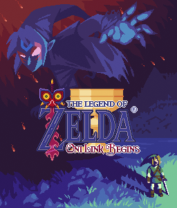

# Zelda Oni Link Begins (v. 4.3)

It's a Miyoo Mini Port and Russian translation of [**Zelda - Oni Link Begins**](http://www.zeldaroth.fr/), a short and pleasant second fangame from Vincent Jouillat. The original game was developed in C++ and was released in 2007.

Based on Zelda OLB 4.3 version.

The logo for the thumbnail image is based on data files from [Solarus Remake of Zelda Oni Link Begins](https://gitlab.com/solarus-games/games/zelda-olb-se) licensed under [Creative Commons Attribution-ShareAlike 4.0 (CC BY-SA 4.0)](http://creativecommons.org/licenses/by-sa/4.0/).
